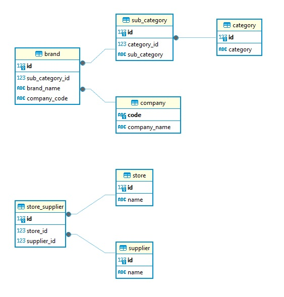
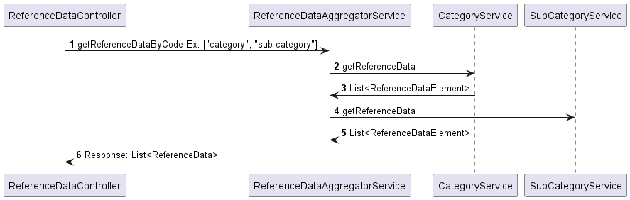

# Reference-Data API design for UI

### What is Reference-Data:
Reference-data is data used to classify or categorize other data. Typically, they are static or slowly changing over time. It’s a special subset of master data that is used for classification throughout your entire organization.

### API contract for UI
Usually reference-data in the UI will be displayed as dropdown to define type or category. One may depend on another. 
Example: if "Category" has "Sub Category", based on Category selection SubCategory dropdown will be populated.

So, We can define json structure for each element of reference data for UI dropdown as.

`{
"linkedEntity": null,
"value": "1",
"label": "Cosmetics"
}`

Now the question arises, what "linkedEntity" will represent?  
List of children or parent element. We will address that in the design consideration.

### Design consideration 
In a typical business domain there will be multiple reference-data, also they may link with each other.
UI application may request arbitrary reference data. Instead of exposing individual rest api endpoint for every reference-data, facade is a good choice here.  
Each reference-data should have unique code, so we can request reference-data like 
`http://host:port/reference-data/lookup?code=category,sub-category`

let's discuss what "linkedEntity" will represent. Consider, if we add child entities in this field,
will cause performance issue and complexity, if we use JPA, then we have to think how to optimize fetch. 
Also depending on the reference-data request code(s) we should build nested object graph as response, will lead to complexity. So adding reference parent id make more sense here.

### Let's consider below Reference-Data ER diagram for the implementation:
In this diagram category and sub_category has one-to-many relationship. store and supplier has many-to-many relationship and store_supplier is join table.  

### Sample request 
`http://localhost:8080/reference-data/lookup?code=category,sub-category,brand`

### Sample response 
`[
    {
    "code": "category",
    "elements": [
                    {
                        "linkedEntity": null,
                        "value": "1",
                        "label": "Cosmetics"
                    }
               ]
    },
    {
    "code": "sub-category",
    "elements": [
                    {
                    "linkedEntity": {
                    "category": "1"
                    },
                    "value": "1",
                    "label": "Soap"
                    }
                ]
    },
    {
    "code": "brand",
    "elements": [
                    {
                    "linkedEntity": {
                    "sub-category": "1",
                    "company": "HUL"
                    },
                    "value": "1",
                    "label": "Lux"
                    }
                ]
    }
]`

Since category is top level entity so "linkedEntity" is null.
For sub-category category is parent entity So, we represent "linkedEntity": { "category": "1" }. 
Finally, brand has two linked entity sub-category and company.
So. we represent "linkedEntity": { "sub-category": "1", "company": "HUL" }  

#### _Please Note:_
For man-to-many relation, say for example store and supplier, We have defined two code for join table "suppliers-for-store" and "stores-for-supplier".
So, we can query 
`http://localhost:8080/reference-data/lookup?code=store,suppliers-for-store`
or
`http://localhost:8080/reference-data/lookup?code=supplier,stores-for-supplier`

### Implementation details:
We have used spring boot and data-jpa with H2 database, just checkout the code and run.

Sequence diagram:

### Source code:
https://github.com/partha-sen/reference-data-api